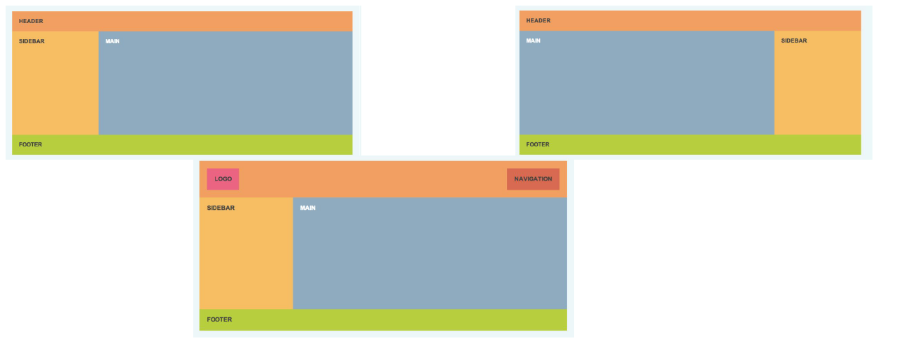

# floats
Add a sidebar and main content floated next to each other with a cleared footer. Make sure the header contains logo and navigation. Let’s use here floats, display property with list and table options and add some content inside boxes. (a list, a table, etc.)
